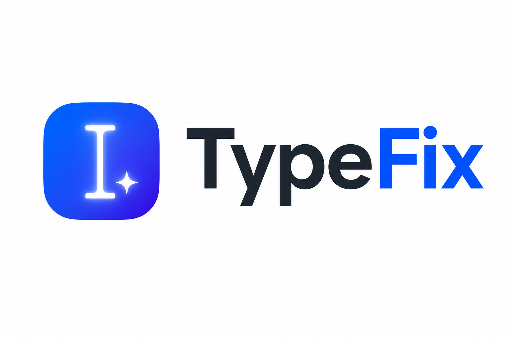
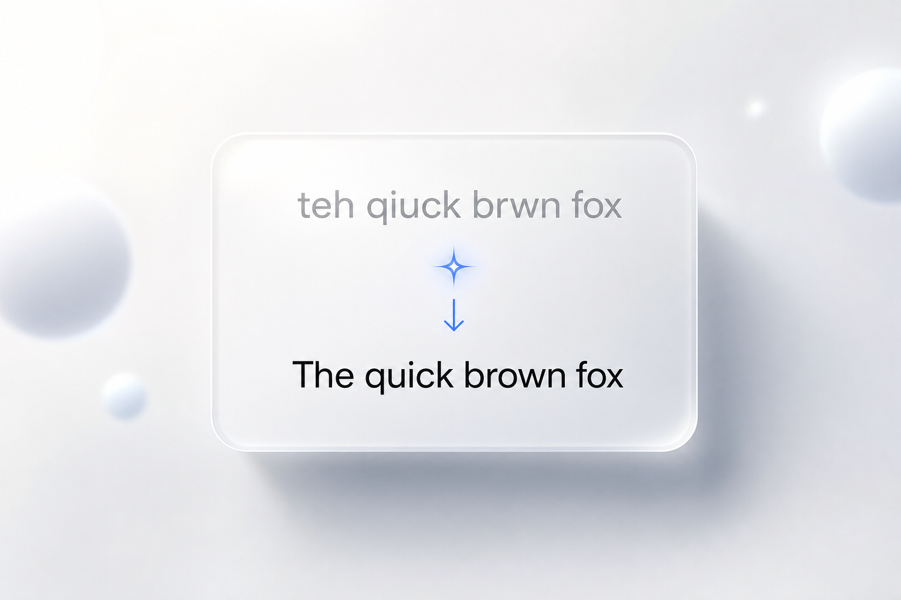
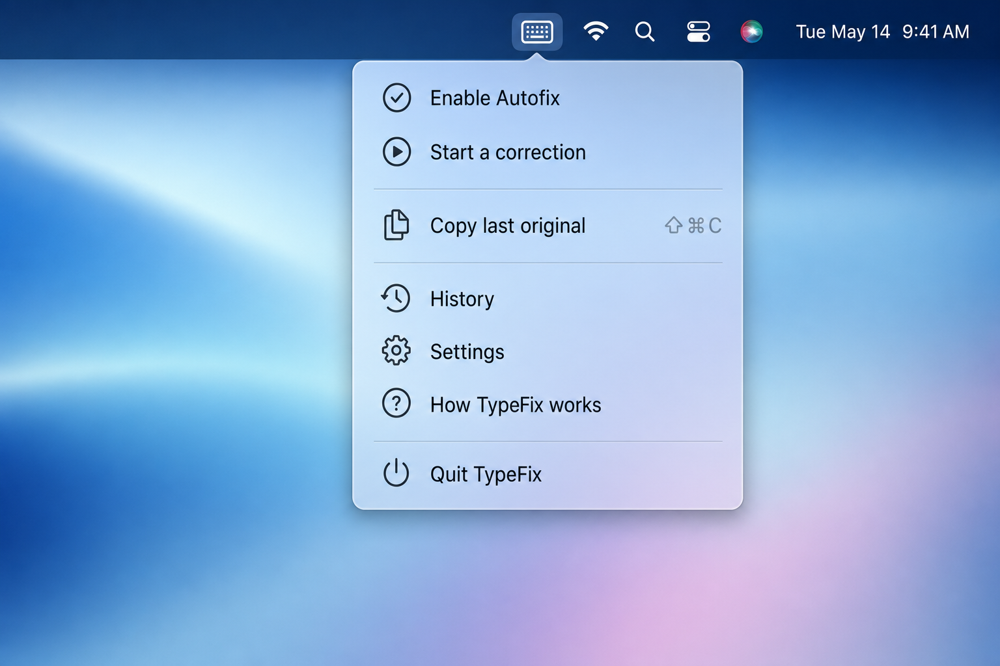
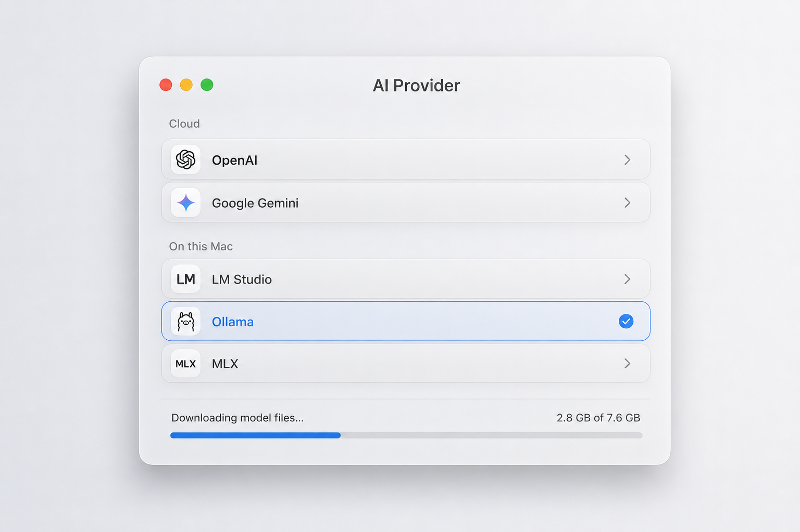

# TypeFix

<p align="center">
  
</p>

<p align="center">
  <b>Type fast and sloppy — TypeFix rewrites it into what you meant, in place, in any app.</b>
</p>

<p align="center">
  
</p>

<p align="center">
  Lives quietly in your menu bar. Bring your own cloud key — or run a model
  <b>fully on‑device</b>, so your words never leave your Mac.
</p>

---

## A quick look

<table>
  <tr>
    <td width="50%" valign="top">
      <br>
      <b>One tap from the menu bar</b><br>
      No Dock icon. Autofix when you pause, or fix on your shortcut.
    </td>
    <td width="50%" valign="top">
      <br>
      <b>Fixed right where you type</b><br>
      A quiet pill confirms it — your text, cleaned in place.
    </td>
  </tr>
  <tr>
    <td width="50%" valign="top">
      <br>
      <b>Private by design</b><br>
      Run locally with MLX or Ollama — nothing leaves your Mac.
    </td>
    <td width="50%" valign="top">
      <br>
      <b>Your AI, your choice</b><br>
      A cloud key or a local model — switch anytime in Settings.
    </td>
  </tr>
</table>

---

## Features

- **Two trigger modes**
  - **Manual** — tap your shortcut to start, type, tap again to fix.
  - **Auto** — it fixes automatically a moment after you stop typing.
- **Customizable shortcut** — defaults to tapping **both Shift keys** together; set any ⌘/⌥/⌃ combo instead.
- **On‑screen traffic light** (Auto mode) so you always know what's happening:
  🟢 typing → 🟡 counting down (shows seconds left) → 🔴 thinking → ✓ fixed.
- **Minimum‑length threshold** — don't bother fixing tiny fragments; a small, quiet note tells you why.
- **History** — see every original → corrected pair and copy your original back if you ever want it. Nothing is lost.
- **Bring your own key** — Anthropic or OpenAI, stored in the macOS Keychain.
- **Or stay fully private** — run a local model so nothing leaves your Mac: a local
  server (Ollama / llama.cpp / LM Studio), an embedded model via Apple **MLX**, or
  Apple's built-in **on-device** model.
- **Clean replacement** — pastes the fix in place (bypassing the target app's autocorrect/auto-period), then restores your clipboard.

## Requirements

- macOS 14 (Sonoma) or later
- **Xcode** (full install) — `build.sh` builds with `xcodebuild` so MLX's Metal shaders get compiled
- An AI backend — pick one:
  - A cloud API key from **Anthropic** or **OpenAI**, or
  - A **local** backend that keeps everything on your Mac:
    - **Ollama** (or any OpenAI-compatible local server) — works on Intel & Apple Silicon
    - **Embedded (MLX)** — downloads a small model once, then runs offline (Apple Silicon only)
    - **Apple on-device** — Apple's built-in model (requires macOS 26 + Apple Intelligence; build with the macOS 26 SDK)

## Install

```bash
# 1. Create a stable local signing identity (once) so the Accessibility
#    permission survives rebuilds.
./setup-signing.sh

# 2. Build the app bundle.
./build.sh release

# 3. Launch it.
open TypeFix.app
```

A keyboard icon appears in the menu bar.

> Because the app is signed with a **self‑signed** identity (not notarized), the
> first launch from Finder may need a right‑click → **Open**, or approval under
> System Settings → Privacy & Security.

## Grant permission

TypeFix needs **Accessibility** permission to read keystrokes and to type the
corrected text back.

1. Menu‑bar icon → **Open Accessibility Settings…**
   (or System Settings → Privacy & Security → **Accessibility**)
2. Enable **TypeFix**.

The icon turns from a warning triangle into a keyboard once granted — no relaunch
needed.

## Choose your AI backend

1. Menu‑bar icon → **Settings…**
2. Under **AI Provider**, pick one. The list is grouped into **Cloud** and
   **On this Mac (private)**.
3. Press **Run Test** to confirm it works.

### Cloud (bring your own key)

Choose **Anthropic** or **OpenAI**, paste your API key (stored in the Keychain),
and pick a model from the dropdown (or **Other** for any model id).

| Provider  | Default model        | Also available |
|-----------|----------------------|----------------|
| Anthropic | `claude-sonnet-4-6`  | `claude-haiku-4-5` (fastest/cheapest), `claude-opus-4-8` (most capable) |
| OpenAI    | `gpt-5.4-mini`       | `gpt-5.4`, `gpt-5.5` (most capable), `gpt-5.4-nano` (cheapest) |

Model ids change over time. If the API returns a "model not found" error, pick a
different model from the dropdown.

### Local — nothing leaves your Mac

| Option | What it needs | Notes |
|--------|---------------|-------|
| **Ollama (local server)** | [Install Ollama](https://ollama.com), run `ollama serve`, then `ollama pull qwen2.5:3b` | No API key. Works on Intel & Apple Silicon. Set the server URL (default `http://localhost:11434/v1`) and model. |
| **Custom endpoint** | Any OpenAI-compatible local server (`llama.cpp`, LM Studio, …) | Enter its base URL and model name; optional token. |
| **Embedded model (MLX)** | Apple Silicon | Click **Download model** in Settings (about 1–3 GB, once). Runs entirely in-app, offline. You can **cancel** a download (it resumes later) and **delete** downloaded models to reclaim space. |
| **Apple on-device** | macOS 26 + Apple Intelligence | Apple's built-in model. Nothing to download. Requires building with the macOS 26 SDK. |

Small local models (≈1.5–4B) are quick and private but follow the "only fix the
typing" instructions less reliably than the big cloud models. The curated MLX
models are **non-thinking instruct** models (reasoning models that emit `<think>`
blocks make poor autocorrectors): **Qwen3 4B Instruct** (default), **Qwen2.5 3B /
1.5B Instruct** (smaller & faster), **Llama 3.2 3B Instruct** (stable fallback),
and **Phi-4 mini Instruct**. You can also enter any other model id via **Other**.

Note: the embedded backend can only run model **architectures** that the pinned
`mlx-swift-examples` version implements (currently includes `qwen3`, `qwen2`,
`llama`, `phi3`, `gemma`, etc.). A brand-new architecture (e.g. `qwen3_5`) will
download but fail to load with "Unsupported model type" until the dependency is
bumped. Stick to text-only `mlx-lm` builds (no vision models).

## Using it

Pick a mode in **Settings → Correction Behavior** (or toggle **Auto‑fix on
pause** straight from the menu).

### Manual (default)

1. Tap your shortcut (default: **both Shift keys** together) — the icon turns into a red record dot.
2. Type whatever; it appears normally as you go.
3. Tap the shortcut again to replace it with the corrected version.
4. Press **Esc** while capturing to cancel.

### Auto

1. Just type normally.
2. Stop for a moment (default **1.5s**, adjustable). TypeFix fixes the chunk in place.
3. Watch the on‑screen pill: 🟢 *Typing* → 🟡 *Fixing in 0.8s* → 🔴 *Thinking* → ✓ *Fixed*.

- Your shortcut does an instant **fix now** in Auto mode.
- A pending fix is **abandoned** if you click elsewhere, use arrows, or press Enter/Tab —
  because the cursor is no longer at the end of what you typed and an in‑place replace wouldn't be safe.
- Fragments shorter than the **minimum length** (default 10 chars) are left alone; a small grey note shows the count.

## Settings overview

| Setting | What it does |
|---------|--------------|
| Mode | Manual vs Auto (fix on pause) |
| Pause before fixing | Auto‑mode idle delay (0.6–4.0s) |
| Minimum characters | Skip auto‑fixing short fragments |
| Trigger shortcut | Both‑Shift (default) or a custom ⌘/⌥/⌃ combo |
| Provider / API key / Model | Your AI backend |
| Enable TypeFix | Master on/off |
| Launch at login | Start automatically |

## Privacy & security

- The text you capture is sent **only** to the AI backend you choose. With a
  **local** backend (Ollama / custom endpoint / embedded MLX / Apple on-device),
  nothing leaves your Mac at all.
- With a cloud provider, don't capture secrets you don't want leaving your machine.
- Your API key is stored in the login **Keychain** (service `com.typefix.app`), never in plain text.
- History is stored locally on your machine (capped to the last 300 entries).

## How it works

| File | Responsibility |
|------|----------------|
| `KeyEventTap.swift` | Active `CGEventTap`: shortcut detection, continuous capture, boundary detection |
| `CorrectionEngine.swift` | State machine for Manual + Auto (pause) modes |
| `TextCorrector.swift` | Routes a correction to the selected backend |
| `CorrectionSupport.swift` | Shared prompt, output cleanup, HTTP helpers, backend protocol |
| `AnthropicBackend.swift` / `OpenAIBackend.swift` | Cloud providers |
| `OpenAICompatibleBackend.swift` | Ollama + custom local OpenAI-compatible servers |
| `MLXBackend.swift` | Embedded on-device model (Apple MLX) + download manager |
| `FoundationModelsBackend.swift` | Apple's built-in on-device model (macOS 26+) |
| `TextReplacer.swift` | Backspaces, then pastes the fix and restores the clipboard |
| `HUDController.swift` | The floating traffic‑light pill + low‑key notes |
| `Hotkey.swift` / `ShortcutRecorder.swift` | Custom shortcut model + recorder |
| `HistoryStore.swift` / `HistoryView.swift` | Correction log + History window |
| `AppDelegate.swift` | Menu‑bar item, windows, permission flow |
| `SettingsView.swift` / `AppSettings.swift` / `Keychain.swift` | Settings UI, preferences, secure key storage |

## Development

```bash
swift build            # quick compile check (no Metal shaders — local MLX models won't run)
./build.sh release     # produce the signed .app via xcodebuild
```

`./build.sh` uses **xcodebuild**, not `swift build`, because the embedded MLX
backend needs its compiled Metal shader library (`default.metallib`). A plain
`swift build` doesn't compile the Metal kernels, so a model would crash on load;
`build.sh` compiles them and copies the result next to the binary as
`mlx.metallib`. Use `swift build` only for fast type-checking.

### Why the self‑signed identity?

macOS ties the Accessibility permission to the app's **code signature**. Ad‑hoc
signing produces a different signature on every build, so each rebuild looks like
a brand‑new app and the grant goes stale. `setup-signing.sh` creates a stable,
self‑signed identity in a dedicated keychain so you approve permissions once.

If you ever need a clean slate:

```bash
tccutil reset Accessibility com.typefix.app
```

## License

MIT — see [LICENSE](LICENSE).
